# tugas-praktikum3
# Latihan python 2
## 1.Memasukan end dan penggunaan separator
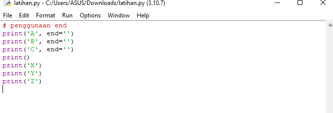
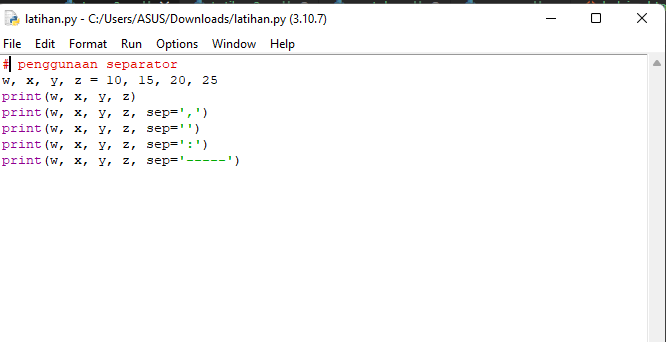
#### -hasil
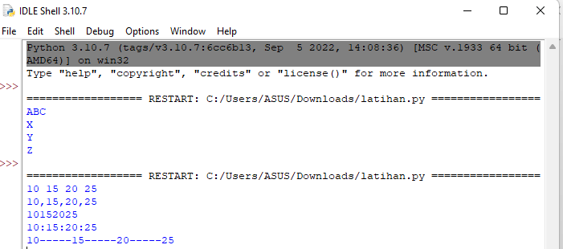

## 2.string format
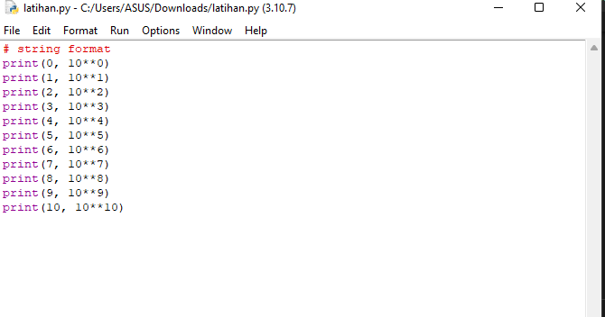
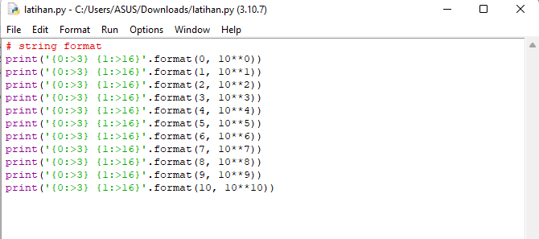
#### -hasil
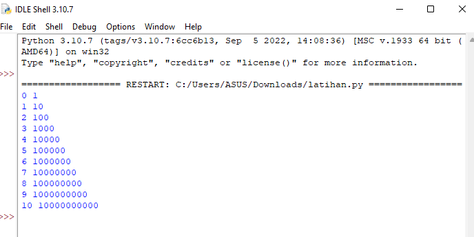
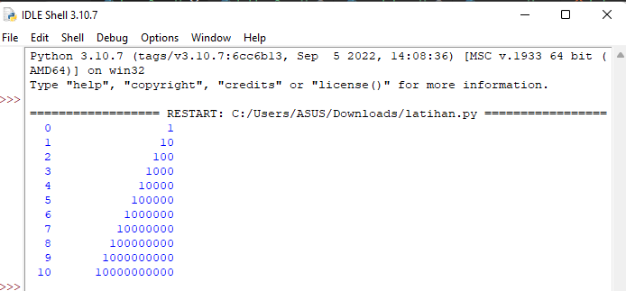

## 3.string ketupat
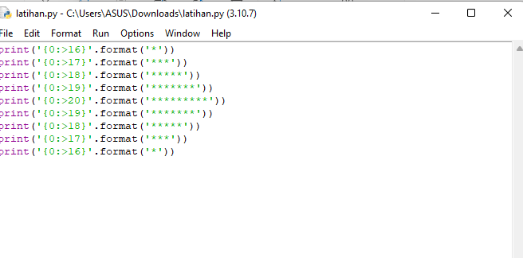
#### -hasil
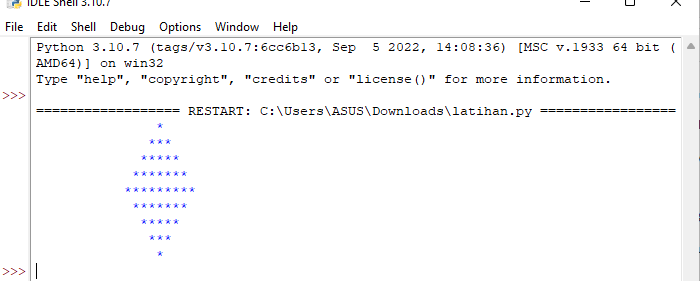

## 4.membuat luas luingkaran dan flowchartnya
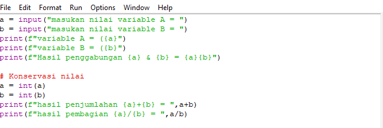
#### -hasil
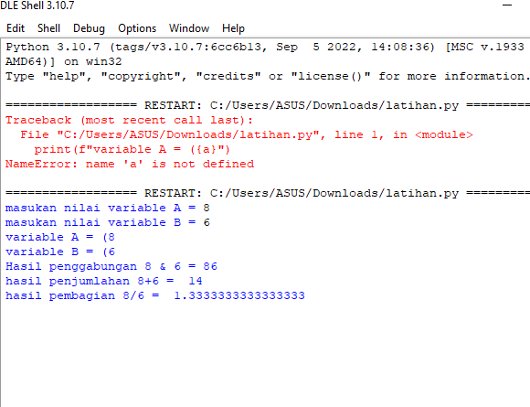
#### -bentuk flowchart
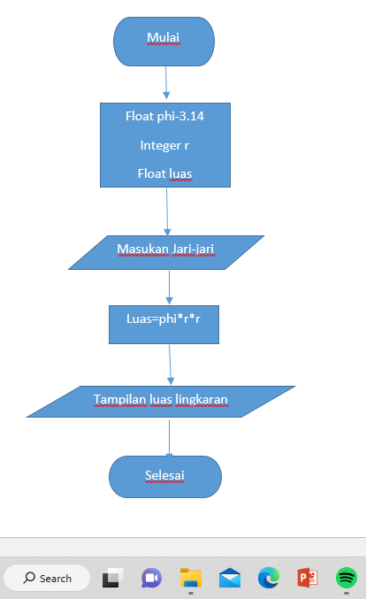
